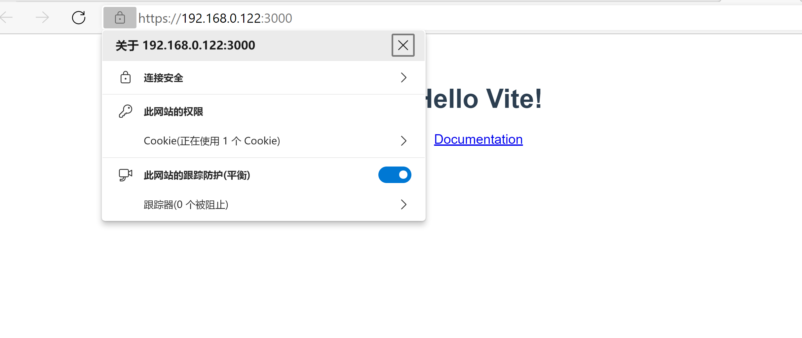

# vite-plugin-mkcert

使用 mkcert 为 vite https 开发服务提供证书支持。

## 什么时候应该使用该插件

1. 当你希望使用 `http/2` 解决 vite http dev server 请求的并发限制时，却发现浏览器缓存无效的情况 [#2725](https://github.com/vitejs/vite/issues/2725)。
2. 有强迫症，希望浏览器不要出现烦人的 https 证书错误。

## 效果

<details>
  <summary>查看</summary>
  
  




</details>

## 快速开始

1. 安装依赖

```sh
yarn add vite-plugin-mkcert -D
```

2. 配置 vite

```ts
import { defineConfig } from 'vite'
import mkcert from 'vite-plugin-mkcert'

// https://vitejs.dev/config/
export default defineConfig({
  server: {
    https: true
  },
  plugins: [mkcert()]
})
```

## 参数

### force

是否强制重新生成证书。

### autoUpgrade

是否自动升级 `mkcert`。

### source

指定 `mkcert` 的下载源，国内用户可以设置成 `coding` 从 coding.net 镜像下载，也可以提供一个自定义的 [BaseSource](plugin/mkcert/Source.ts)。

### mkcertPath

如果网络受限的话，可以指定一个本地的 `mkcert` 文件来代替网络下载。

### hosts

自定义域名，默认使用 `localhost` + 本地 ip 列表。

## 移动端设备使用

为了使证书在移动设备上被信任，你必须安装根证书 `rootCA.pem` 文件。可以使用 `mkcert -CAROOT' 命令打印它所在的文件夹。

在 iOS 上，你可以使用 AirDrop 隔空投送，或者用 CA 用电子邮件发给自己，或者从 HTTP 服务器上提供。打开后，你需要[在设置>已下载描述文件中安装配置文件](https://github.com/FiloSottile/mkcert/issues/233#issuecomment-690110809)，然后[对其启用完全信任](https://support.apple.com/zh-cn/HT204477)。

对于安卓系统，安装根证书 CA ，然后在你的应用程序的开发构建中启用用户根证书。见 [StackOverflow 的答案](https://stackoverflow.com/a/22040887/749014)。

## 显示插件的调试信息

设置环境变量 `DEBUG`=`vite:plugin:mkcert`

## 更新日志

[CHANGELOG](CHANGELOG.md)

## 原理

使用 [mkcert](https://github.com/FiloSottile/mkcert) 安装本地 `CA` 证书，并为 [server.https](https://vitejs.bootcss.com/config/#server-https) 生成服务端证书。

## 友情提示

1. `mkcert` 保存目录：[PLUGIN_DATA_DIR](plugin/lib/constant.ts)
2. 卸载 `CA` 证书：`mkcert -uninstall`

## 感谢

- [mkcert](https://github.com/FiloSottile/mkcert)
- [daquinoaldo/https-localhost](https://github.com/daquinoaldo/https-localhost)
